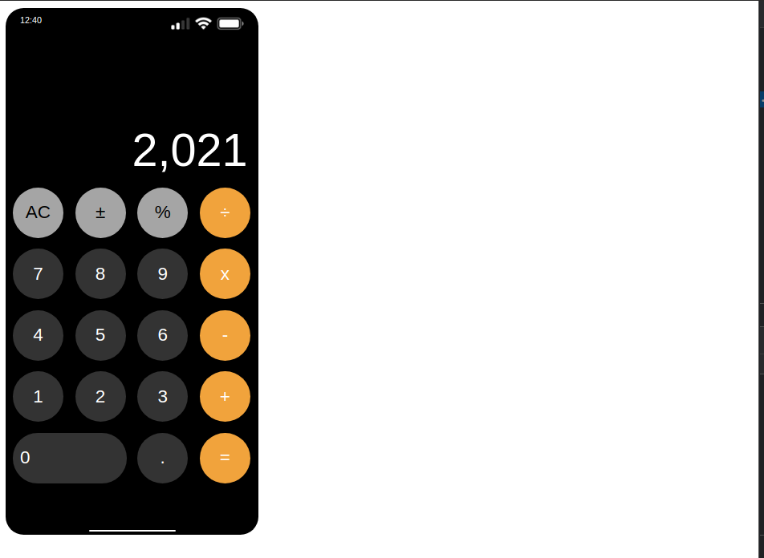

## Iphone-Calulator
<h1> Projeto Caluladora </h1>
<h2>Calulador Iphone com funções similares do iphone<h2>

 _____________________

## 🚀 Tecnologias

- HTML
- CSS
- JavaScript

 <h3>Conceitos colocados em prática</h3>
         <ul>
             <li>Estilização CSS/Flex-box/Grid</li>
             <li>Manipulação do DOM</li>
             <li>Lógica de programação</li>
             <li>Estrutura de repetição</li>
             <li>Metódos de array em JavaScript</li>
         </ul>

